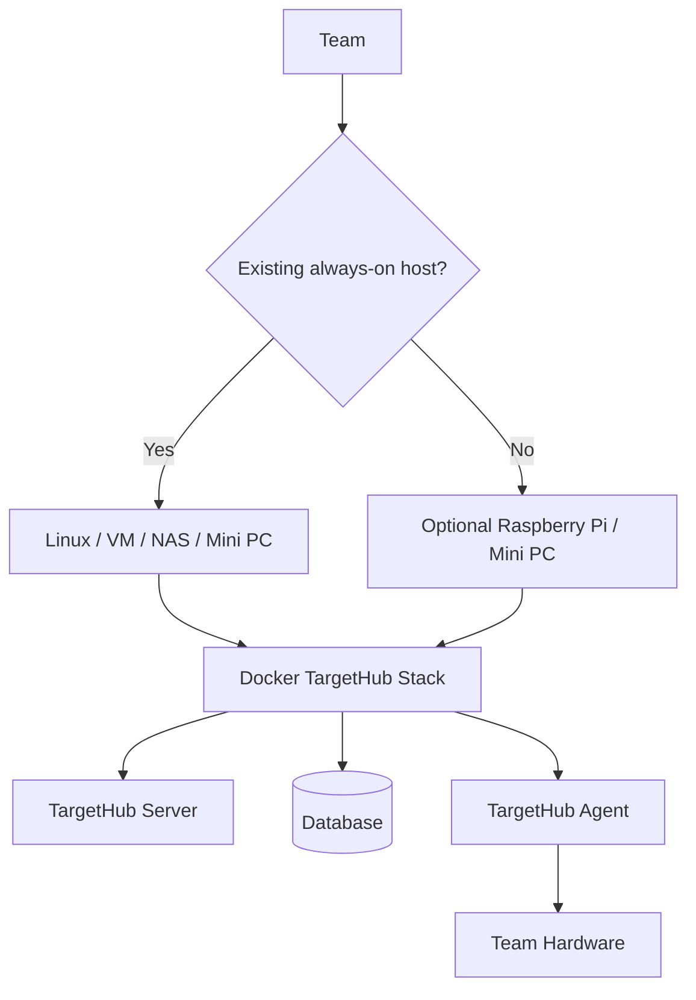
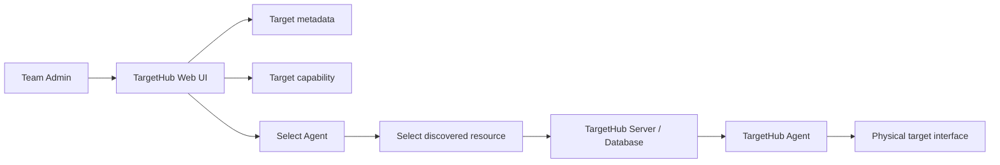

# TargetHub Architecture v1.0 — Implementation Baseline

This file records the implementation-facing rules from the TargetHub Architecture v1.0 blueprint. The full visual blueprint is maintained alongside the project architecture documentation.

## Baseline rules

- TargetHub is self-hosted per team; there is no mandatory central TargetHub server.
- Docker is the standard packaging/deployment mechanism.
- Raspberry Pi / mini PC is an optional TargetHub Appliance for teams without an always-on host.
- Server and Agent are separate logical components and may be colocated.
- A Target is a logical resource with multiple capabilities/interfaces.
- Reservation is the prerequisite for controlled access.
- Sessions are separate from reservations and are tied to authorized target access.
- Hardware-specific operations are implemented through providers.
- Web and CLI consume the common API; VS Code is a future API client.
- DD remains an external REST-controlled power system integrated through a provider.
- Access exclusivity is only guaranteed where the deployment controls the access path.
- Development proceeds through small functional vertical slices.

## Target capability and Agent resource model

A Target remains a logical resource. A capability identifies an interface, while an Agent owns the physical resources available on a host.

```text
Target
 ├── metadata
 └── capabilities
      ├── serial
      ├── network
      ├── ssh
      ├── telnet
      ├── ftp
      ├── jlink
      ├── power
      └── reset

Agent
 └── discovered resources
      ├── serial device
      ├── J-Link
      ├── network resource
      └── other hardware resources
```

The Server stores the relationship:

```text
Target capability -> Agent -> discovered physical resource
```

`provider_key` and `provider_config` remain internal implementation fields. They are not part of the normal team-admin workflow. The Web UI asks the administrator to select an Agent and a resource discovered by that Agent; the backend can persist provider-specific details without requiring the administrator to enter JSON or Linux device paths manually.

Example user-facing flow:

```text
BOARD-01
  -> Add capability: Serial Console
  -> Select Agent: lab-pi-01
  -> Select detected resource: USB Serial /dev/ttyUSB0
  -> Save
```

Example internal relationship:

```text
BOARD-01
  └── serial-console
       ├── agent_id: lab-pi-01
       ├── resource_id: detected-resource-id
       └── provider configuration: internal
```

## Agent discovery contract

The current implementation establishes the first Agent boundary as a registry/discovery contract:

- An Agent can register with the Server.
- An Agent can report its hostname and currently discovered resources through heartbeat.
- Resources have a type, display name, stable resource key, metadata, and availability state.
- The Server exposes registered Agents and their resources to the Web UI.
- The physical discovery implementation on Linux/Raspberry Pi is intentionally a subsequent Agent increment.

This keeps the Web UI independent of `/dev/ttyUSB*`, J-Link serial numbers, or other host-specific details.

## Deployment model



## Web administration model



The current Web UI provides the first administration slice: a team administrator can create/edit targets and add/remove/configure capabilities by selecting an Agent and detected resource. Authentication/RBAC enforcement is a separate security increment; the current development UI uses the existing local `developer` identity.

The user workflow is:

```text
User -> Target list -> Reserve -> Authorized session -> Capability access
Admin -> Target administration -> Select Agent/resource -> Configure target/capabilities
```

## Development sequence

1. Preserve and evolve existing Target CRUD. **Done.**
2. Establish Target capability abstraction. **Done.**
3. Establish Agent/provider boundaries. **Initial Agent registry/resource discovery contract now implemented; physical Agent discovery remains.**
4. Implement Reservation Engine. **Done and manually verified.**
5. Implement Session model and authorization boundary. **Done and manually verified.**
6. Implement Serial as the first real provider. **Initial pyserial provider and health API exist; physical Agent/device transport remains.**
7. Complete the first Web UI workflow for team target administration and reservation/release. **Administration now selects Agent resources; reservation/release is available.**
8. Implement physical Agent discovery and session-bound serial access.
9. Implement DD Power/Reset.
10. Design and implement network/SSH/Telnet/FTP enforcement.
11. Validate J-Link/Cortex-Debug integration.
12. Add CLI and later VS Code integration.

Material architectural changes must trigger an architecture version review rather than silently changing the baseline.
