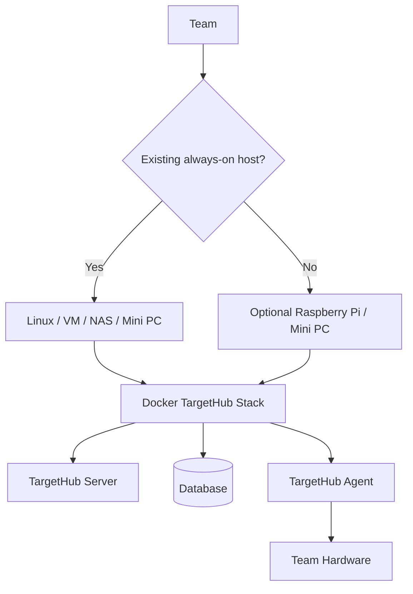
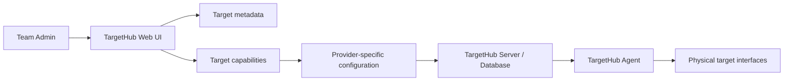

# TargetHub Architecture v1.0 — Implementation Baseline

This file records the implementation-facing rules from the TargetHub Architecture v1.0 blueprint. The full visual blueprint is maintained alongside the project architecture documentation.

## Baseline rules

- TargetHub is self-hosted per team; there is no mandatory central TargetHub server.
- Docker is the standard packaging/deployment mechanism.
- Raspberry Pi / mini PC is an optional TargetHub Appliance for teams without an always-on host.
- Server and Agent are separate logical components and may be colocated.
- A Target is a logical resource with multiple capabilities/interfaces.
- Reservation is the prerequisite for controlled access.
- Sessions are separate from reservations and are tied to authorized target access.
- Hardware-specific operations are implemented through providers.
- Web and CLI consume the common API; VS Code is a future API client.
- DD remains an external REST-controlled power system integrated through a provider.
- Access exclusivity is only guaranteed where the deployment controls the access path.
- Development proceeds through small functional vertical slices.

## Target capability model

The implementation now represents a target as:

```text
Target
 ├── metadata
 └── capabilities
      ├── serial
      ├── network
      ├── ssh
      ├── telnet
      ├── ftp
      ├── jlink
      ├── power
      └── reset
```

`provider_key` identifies the provider implementation/configuration responsible for a capability. `provider_config` stores provider-specific target configuration separately from Target metadata. The TargetHub Server stores this configuration; the Agent/provider is responsible for interpreting it when it reaches the physical host.

Example:

```text
BOARD-01
  └── serial-console
       ├── capability_type: serial
       ├── provider_key: serial.dev.01
       └── provider_config:
            device_path: /dev/ttyUSB0
            baudrate: 115200
            timeout: 0.2
```

This means an administrator can configure the logical `/dev/ttyUSB0` mapping for a team's chosen host/Agent without adding hardware-specific columns to the Target table.

## Deployment model



## Web administration model



The current Web UI provides the first administration slice: a team administrator can create/edit targets and add/remove/configure capabilities. The capability configuration is persisted as provider-specific configuration. Authentication/RBAC enforcement is a separate security increment; the current development UI uses the existing local `developer` identity.

The user workflow is:

```text
User -> Target list -> Reserve -> Authorized session -> Capability access
Admin -> Target administration -> Configure target/capabilities
```

## Development sequence

1. Preserve and evolve existing Target CRUD.
2. Establish Target capability abstraction. **Done in the alignment pass.**
3. Establish Agent/provider boundaries. **Done in the alignment pass.**
4. Implement Reservation Engine. **Done and manually verified.**
5. Implement Session model and authorization boundary. **Done and manually verified.**
6. Implement Serial as the first real provider. **Initial provider slice done: concrete pyserial provider, deployment configuration, health API, and provider-specific capability configuration.**
7. Complete the first Web UI workflow for team target administration and reservation/release. **Initial administration slice now implemented; reservation/release already available in the dashboard.**
8. Continue Serial through the Agent/device transport and session-bound serial access.
9. Implement DD Power/Reset.
10. Design and implement network/SSH/Telnet/FTP enforcement.
11. Validate J-Link/Cortex-Debug integration.
12. Add CLI and later VS Code integration.

The serial work remains intentionally incremental. The current slice establishes the concrete provider boundary and hardware configuration path; session-bound serial streaming and the TargetHub Agent/device transport are subsequent serial slices.

Material architectural changes must trigger an architecture version review rather than silently changing the baseline.
