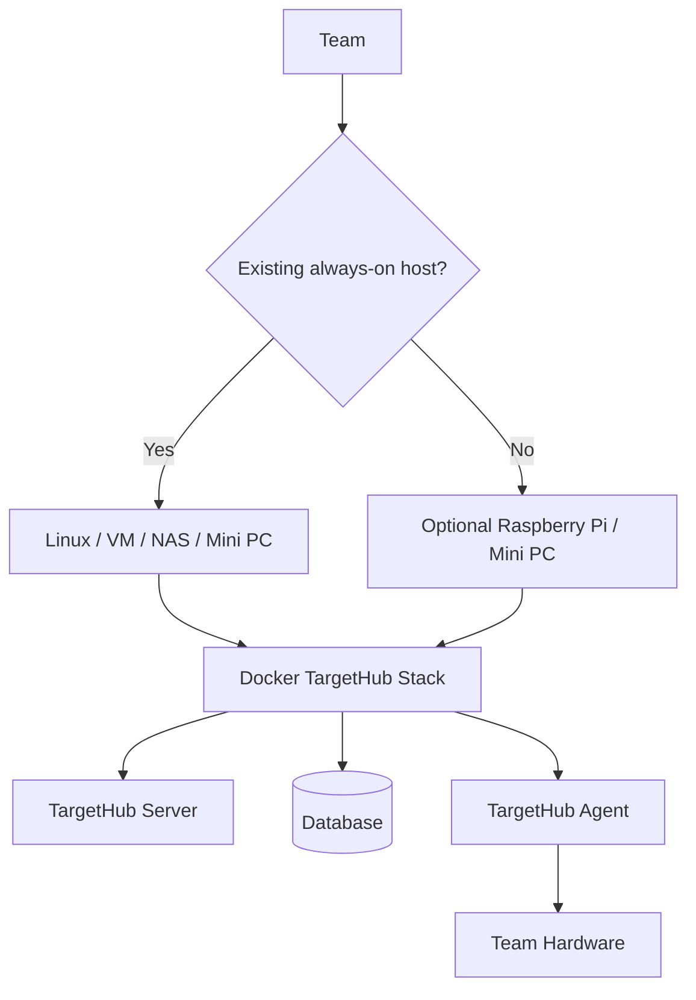

# TargetHub Architecture v1.0 — Implementation Baseline

This file records the implementation-facing rules from the TargetHub Architecture v1.0 blueprint. The full visual blueprint is maintained alongside the project architecture documentation.

## Baseline rules

- TargetHub is self-hosted per team; there is no mandatory central TargetHub server.
- Docker is the standard packaging/deployment mechanism.
- Raspberry Pi / mini PC is an optional TargetHub Appliance for teams without an always-on host.
- Server and Agent are separate logical components and may be colocated.
- A Target is a logical resource with multiple capabilities/interfaces.
- Reservation is the prerequisite for controlled access.
- Sessions are separate from reservations and are tied to authorized target access.
- Hardware-specific operations are implemented through providers.
- Web and CLI consume the common API; VS Code is a future API client.
- DD remains an external REST-controlled power system integrated through a provider.
- Access exclusivity is only guaranteed where the deployment controls the access path.
- Development proceeds through small functional vertical slices.

## Target capability model

The implementation now represents a target as:

```text
Target
 ├── metadata
 └── capabilities
      ├── serial
      ├── network
      ├── ssh
      ├── telnet
      ├── ftp
      ├── jlink
      ├── power
      └── reset
```

`provider_key` identifies the provider configuration responsible for a capability without coupling the Target model to a particular hardware implementation.

## Deployment model



## Development sequence

1. Preserve and evolve existing Target CRUD.
2. Establish Target capability abstraction. **Done in the alignment pass.**
3. Establish Agent/provider boundaries. **Done in the alignment pass.**
4. Implement Reservation Engine. **Done and manually verified.**
5. Implement Session model and authorization boundary. **Done and manually verified.**
6. Implement Serial as the first real provider. **Initial provider slice done: concrete pyserial provider, deployment configuration, and health API.**
7. Implement DD Power/Reset.
8. Design and implement network/SSH/Telnet/FTP enforcement.
9. Validate J-Link/Cortex-Debug integration.
10. Add CLI and later VS Code integration.

The serial work is intentionally incremental. The current slice establishes the concrete provider boundary and hardware health/configuration path; session-bound serial streaming and the TargetHub Agent/device transport are subsequent serial slices.

Material architectural changes must trigger an architecture version review rather than silently changing the baseline.
